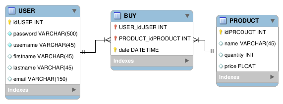
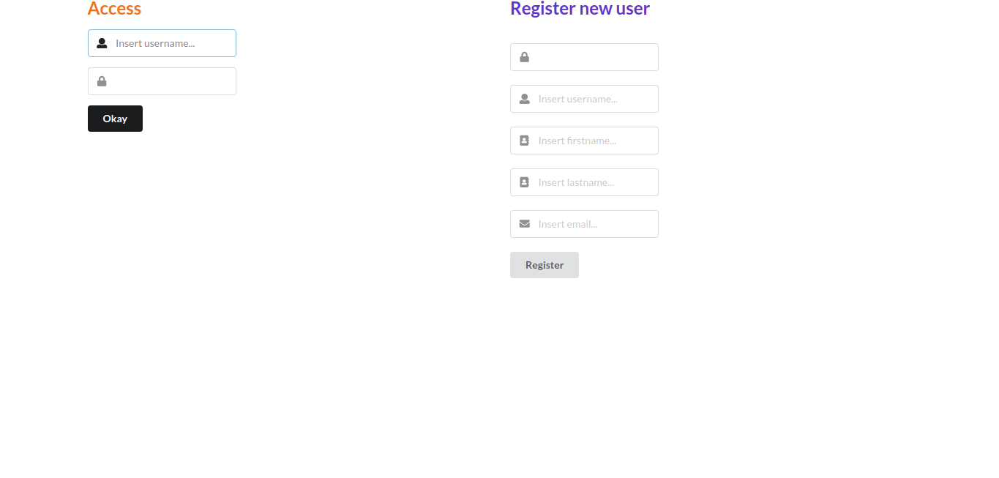
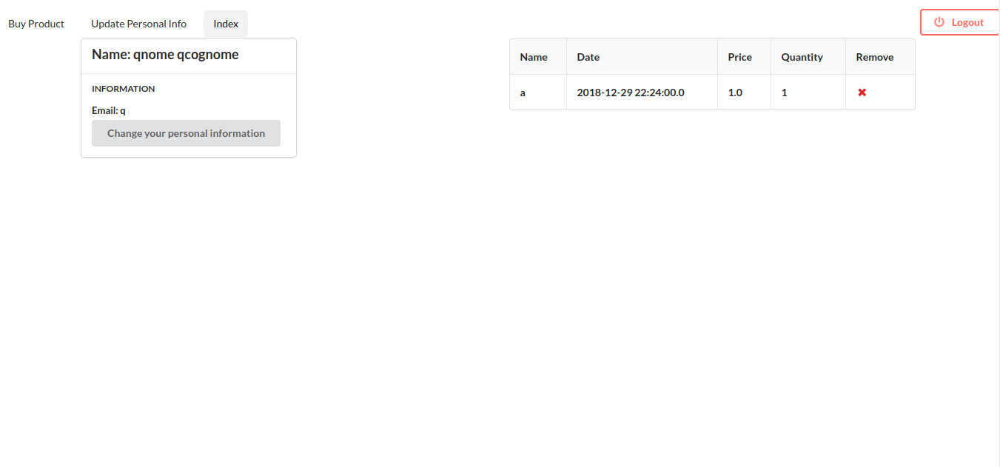
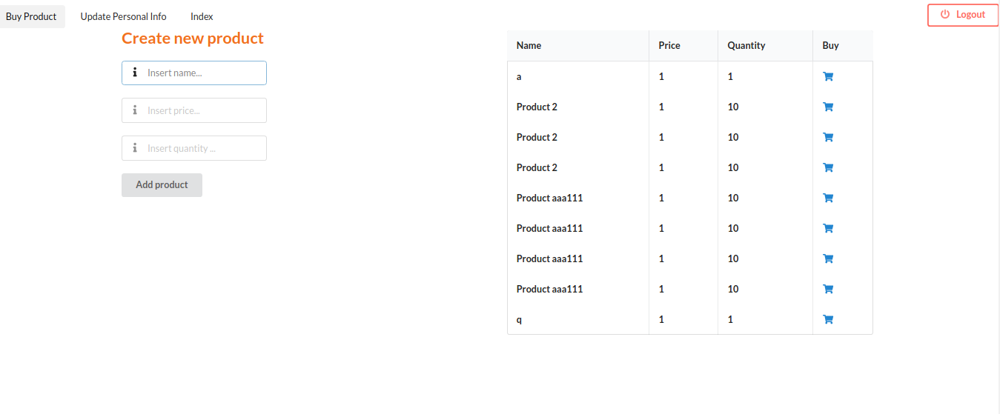
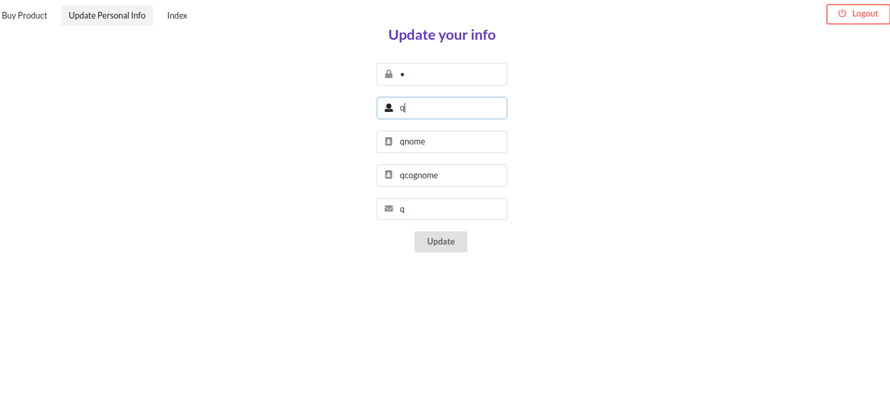

# Sample Spring, Hibernate and Semantic web application

It is a simple application in order to show the Spring and Hibernate configuration for an web application.

## Configuration

Use createDBFromModel.sql in db folder, in order to create a MySql schema. Otherwise, it is possible import the db.mwb model in Workbench.

After MySql schema creation, it is possible populate a db with Workbench tools.

The database is more simple. It is a sample the "user buy product".
.


Modify a hibernate.cfg.xml in resources folder:

```xml
        <property name="hibernate.connection.password"></property>
        <property name="hibernate.connection.username"></property>
```

Add personal username and password in order to permit a Hibernate connection.

After populating the db, you can install the web app. Launch the command:

```
mvn clean install
```

and the war is created. So now it is only necessary to load the war into Tomcat.

## Useful information

### Maven

Maven allows you to manage the lifecycle of the web app. Starting from dependencies to the war creation.

### Spring

The web application exploits:

   - Spring Security: personal login, token authentication, personal URL, csrf protection.
    
   - Spring Model View controller: create interceptor for match a url, set page resolver and create a rest.
   
   - Web filter, in order to change a max inactive session time when user is log in and redirect to login page if user is not authenticated.
   
   - Example a scheduler.
   
   - Hibernate configuration, using a "hibernate.cfg.xml".
   
### Hibernate

The model class are generated with Intellij with JPA support. The simple CRUD is implemented: 

   - Create new user and new product.
   - Read user information, user login information, all product and all user purchases.
   - Update user information.
   - Delete an product ora an purchase.
   - A c3p0 connection and pooling is used.
   
### Semantic

Semantic is chosen to user interface. It exploits a JQuery and JavaScript functions.

## Some screenshots

.

.

.

.
